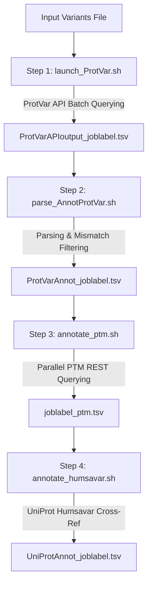

# UniProt Variant Annotation Pipeline

An automated, high-performance bioinformatic pipeline for annotating human genomic variants. The pipeline queries the EBI ProtVar API, parses and filters functional/structural predictions, enriches variants with Post-Translational Modifications (PTMs), and cross-references curated disease classifications from UniProt Humsavar.

---

## Table of Contents

- [Overview](#overview)
- [Setup & Requirements](#setup--requirements)
- [Quick Start](#quick-start)
- [Pipeline Architecture & Workflow](#pipeline-architecture--workflow)
- [Output Data Schema](#output-data-schema)
- [HPC / Slurm Execution](#hpc--slurm-execution)
- [Low-Level ProtVar API Tools](#low-level-protvar-api-tools)
- [Assembly & Technical Notes](#assembly--technical-notes)

---

## Overview

The **UniProt Variant Annotation Pipeline** streamlines variant interpretation by executing a 4-step workflow:

1. **ProtVar API Batch Querying**: Submits variants in parallel batches (100,000 variants/chunk) to EBI ProtVar.
2. **Annotation Parsing & Quality Filtering**: Filters out unmapped variants and reference allele mismatches while extracting functional, structural, and pathogenicity scores.
3. **PTM Enrichment**: Queries the EBI ProtVar REST API in parallel (`xargs -P 20`) to annotate Post-Translational Modifications.
4. **UniProt Humsavar Disease Variant Cross-Referencing**: Annotates curated human disease variant classifications (`humsavar.txt`).

---

## Setup & Requirements

The environment is managed using [`pixi`](https://pixi.sh). To set up the environment and install required dependencies (`python 3.12`, `requests`), run:

```bash
pixi install
```

All pipeline commands can then be executed inside the `pixi` environment.

---

## Quick Start

Run the full annotation pipeline using `run_pipeline.sh`:

```bash
pixi run bash run_pipeline.sh <variants_file> <assembly> <job_label>
```

### Parameters:
- `<variants_file>`: Path to the input text file containing one variant per line (e.g. `10-98251583-C-T` or `10:100011120:A:T`). The pipeline accepts direct file paths (e.g., `data/test.txt` or `test.txt` inside the `data/` directory).
- `<assembly>`: Reference genome assembly for input variant coordinates. Must be **`GRCh37`** or **`GRCh38`**.
- `<job_label>`: Unique name/identifier for the run. Output files will be organized under `results/<job_label>/`.

### Example:
```bash
pixi run bash run_pipeline.sh data/test.txt GRCh37 test_run
```

**Final Output Location**: `results/test_run/UniProtAnnot_test_run.tsv`

---

## Pipeline Architecture & Workflow

The master script `run_pipeline.sh` orchestrates four sequential steps:



### Step 1: ProtVar API Querying (`launch_ProtVar.sh`)
- Splits large variant lists into sub-batches of 100,000 variants each in a temporary directory.
- Sequentially uploads batches via `submit.py`, requests full annotations via `create_download.py`, polls for completion via `poll.py`, and streams zipped CSV output files using `retrieve.py`.
- Aggregates unzipped CSV output chunks and converts them into a master TSV file: `results/<job_label>/ProtVarAPIoutput_<job_label>.tsv`.

### Step 2: Parsing & Quality Filtering (`parse_AnnotProtVar.sh`)
- Extracts 18 key annotation fields including HGVS amino acid change notation, binding pockets, FoldX stability predictions, AlphaFold pLDDT scores, evolutionary conservation, AlphaMissense, popEVE, and ESM1b pathogenicity classes.
- **Quality Filter**: Discards unmapped variants (`No mapping found`) and reference allele mismatch warnings (`WARN:User input reference allele (...) does not match the UniProt sequence (...)`).
- Output: `results/<job_label>/ProtVarAnnot_<job_label>.tsv`.

### Step 3: PTM Annotation (`annotate_ptm.sh`)
- Extracts unique `(uniprot_id, position, new_aa)` tuples from parsed variants to minimize redundant network calls.
- Executes parallel REST API requests against EBI ProtVar (`xargs -P 20`) using `curl` and `jq`.
- Performs an in-memory `awk` merge to inject the `ptm` annotation column.
- Output: `results/<job_label>/<job_label>_ptm.tsv`.

### Step 4: UniProt Humsavar Disease Annotation (`annotate_humsavar.sh`)
- Automatically downloads and caches the latest UniProt `humsavar.txt` dataset into `databases/humsavar_<RELEASE>.txt`.
- Matches variants on `(gene, uniprot_id, aa_acid_change)`.
- Appends the `UniProt_CuratedClassif` column and generates the final output file: `results/<job_label>/UniProtAnnot_<job_label>.tsv`.

---

## Output Data Schema

The final output file (`results/<job_label>/UniProtAnnot_<job_label>.tsv`) is a tab-separated file containing the following 19 columns:

| Column Number | Column Name | Description | Example / Values |
|---|---|---|---|
| 1 | `user_variant` | Original variant string provided in input | `10-98251583-C-T` |
| 2 | `grch38_coord` | Mapped genomic position (`chr:pos:ref:alt`) | `10:98251583:C:T` |
| 3 | `gene` | Associated gene symbol | `FGFR2` |
| 4 | `uniprot_id` | Canonical UniProt accession ID | `P21802` |
| 5 | `consequence` | Variant consequence term | `missense_variant` |
| 6 | `codon_change` | Nucleotide codon change | `tTg/tCg` |
| 7 | `aa_acid_change` | Amino acid substitution in HGVS format | `p.Leu380Ser` |
| 8 | `residue_function` | Specific UniProt residue functional annotation & evidence | `ACT_SITE (By similarity)` |
| 9 | `region_function` | Domain/region functional annotation & evidence | `DOMAIN Protein kinase` |
| 10 | `interactions_genes` | Interacting gene symbols | `GRB2,STAT1` or `-` |
| 11 | `pocket_label` | AlphaFold predicted pocket presence confidence | `very high`, `high`, `low`, `-` |
| 12 | `alphafold-foldxDdg` | FoldX predicted protein stability impact | `destabilising`, `stabilising/neutral`, `-` |
| 13 | `alphafold-plddt` | AlphaFold structural confidence level | `Very high`, `High`, `Low`, `Very low`, `-` |
| 14 | `conservation` | Position evolutionary conservation score | Scale `0-1` (`1` = highly conserved) |
| 15 | `alphamissense` | AlphaMissense pathogenicity class | `likely_pathogenic`, `likely_benign`, `ambiguous`, `-` |
| 16 | `popeve` | popEVE population impact score | `popEVE score` or `-` |
| 17 | `esm1b` | ESM1b language model score class | `pathogenic`, `uncertain`, `benign`, `-` |
| 18 | `ptm` | Post-Translational Modification annotation & evidence | `Phosphoserine (...)` or `Not ptm` |
| 19 | `UniProt_CuratedClassif` | UniProt Humsavar curated human disease classification | `LP/P (Pfeiffer syndrome)` or `-` |

---

## HPC / Slurm Execution

For high-performance computing clusters running Slurm, submit the pipeline using `sbatch`:

```bash
sbatch submit_pipeline.slurm
```

Example `submit_pipeline.slurm` script:

```bash
#!/bin/bash
#SBATCH --job-name=uniprot_annot
#SBATCH --nodes=1
#SBATCH --ntasks=1
#SBATCH --cpus-per-task=30
#SBATCH --mem=90G
#SBATCH --time=24:00:00
#SBATCH --output=uniprot_annot_%j.log
#SBATCH --error=uniprot_annot_%j.err

set -e

# Parameters
INPUT_FILE="data/test.txt"
ASSEMBLY="GRCh37"
JOB_LABEL="test_job"

echo "Starting UniProt Annotation Pipeline on $(hostname)..."
pixi run bash run_pipeline.sh "$INPUT_FILE" "$ASSEMBLY" "$JOB_LABEL"
echo "Pipeline finished successfully!"
```

---

## Low-Level ProtVar API Tools

If you need to interact with the EBI ProtVar API directly outside the master pipeline, the repository includes modular Python CLI tools:

- **`submit.py`**: Uploads a variant file and returns an upload `resultId`.
  ```bash
  python submit.py --input data/test.txt --assembly GRCh37 --jobid-file results/jobid.txt
  ```
- **`create_download.py`**: Requests a download job for a given `resultId`.
  ```bash
  python create_download.py --result-id results/jobid.txt --assembly GRCh37 --annotations full --jobid-file results/download_jobid.txt
  ```
- **`poll.py`**: Checks the status (`queued`, `processing`, `ready`, `failed`) of a download job.
  ```bash
  python poll.py --job-id results/download_jobid.txt
  ```
- **`retrieve.py`**: Streams finished result `.zip` files from ProtVar to disk.
  ```bash
  python retrieve.py --download-id results/download_jobid.txt --outdir results/
  ```

---

## Assembly & Technical Notes

- **Assembly Options**: In the main pipeline (`run_pipeline.sh`), the `<assembly>` parameter strictly accepts **`GRCh37`** or **`GRCh38`**. The `AUTO` mode is **not** supported in the general pipeline.
- **ProtVar API Download Behavior**:
  - During low-level API testing with GRCh37 variants, passing explicit `--assembly GRCh37` during the download step (`create_download.py`) was observed to return fewer rows from the ProtVar remote server than expected. Passing `--assembly AUTO` during the download step produced full row counts.
  - Detailed findings and side-by-side comparison logs are documented in `assembly_auto_vs_grch37_notes.txt`.
